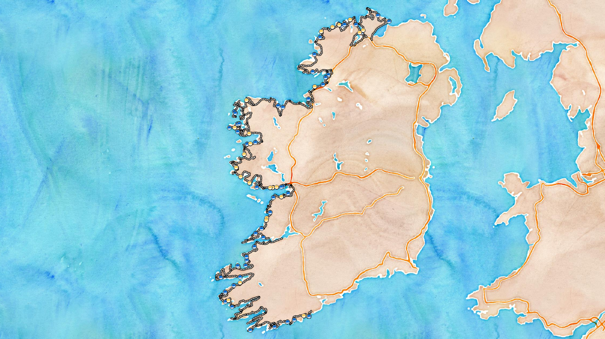
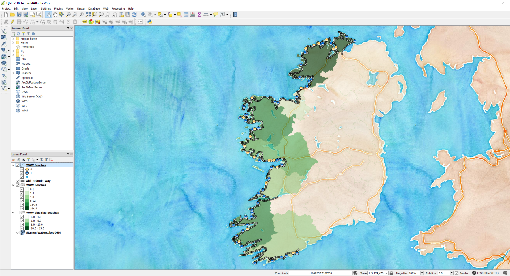
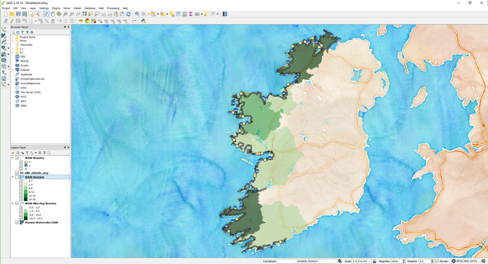
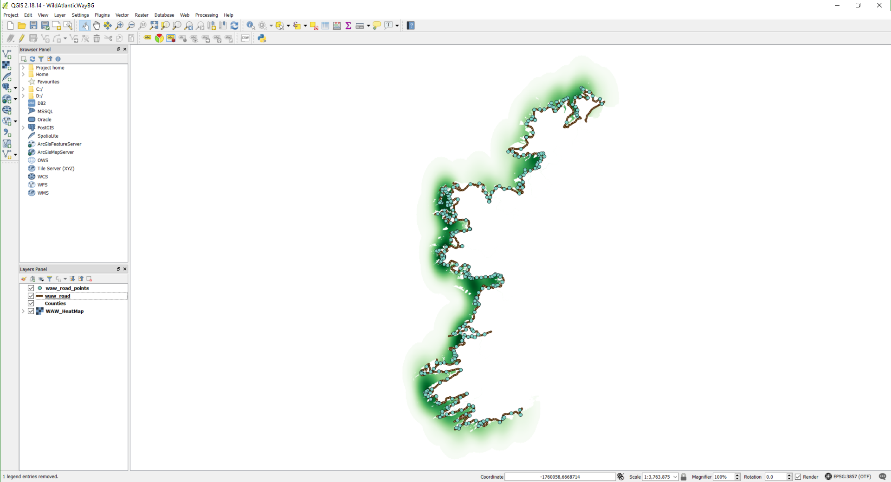

```{r setup, include=FALSE}
knitr::opts_chunk$set(comment = "", error = TRUE, options(digits=3), echo=F)
library(tidyverse)
```


#Introduction

I grew up near the town of Ballybunnion in Co. Kerry. Ballybunnion is a town that survives on tourism. The Blue Flag status of it's beaches as well as the Wild Atlantic Way (WAW) are very important factors in attracting tourists. I did a quick search online and there doesn't seem to be any maps showing the Wild Atlantic Way and it's beaches. There is a map of blue flag beaches on [blueflagireland.org](http://www.blueflagireland.org/locations.10.html), but there is nothing to relate this information to the Wild Atlantic Way. 

I decided to create maps that show the Wild Atlantic Way and its beaches all in one place. I'm aiming to create an easy to follow vibrant map that can show all the beaches that the Wild Atlantic Way has to offer.

#Spatial Data Used

##Blue Flag Beaches Points
My first attempt to get this data was from the [EPA](https://gis.epa.ie/EPAMaps/) website, unfortunately the GeoJSON from this site was incomplete and only contained the blue flag beaches from the east coast. After more searching I got a shapefile from [MIDA](http://mida.ucc.ie/pages/atlas/search/search.php?stopic=keywords&sTitle=&sKeywords%5B%5D=Beaches&x=5&y=6 "mida.ucc.ie"), it contains blue flag beach data from 1988 to 2014; I decided to use the 2014 data. I added this data to my project on QGIS and then imported it into PostGIS as a table called `blueflag`.

##The Wild Atlantic Way Multiline
I downloaded the GeoJSON file from [here](https://gist.github.com/vool/3b6a683f84d51b7e9a10). The GeoJSON is poly-lines of the Wild Atlantic Way route. I imported this into PostGIS as `waw_road` via QGIS.

##Irish Counties Polygons
The last data set I obtained was a shape file of the counties from [townlands.ie](https://www.townlands.ie/page/download/). Again I used QGIS to import this data into PostGIS as `county`.

#Beaches of the Wild Atlantic Way

##Prepping the Data
I started by downloading the data and loading the layers onto QGIS.I then imported it into PostGIS. After looking at all the tables it was clear that the `county` and `blueflag` tables had alot of irrelevant data that I did not need, therefore I decided to query these tables to make my own tables.  

The first query creates the table `waw_bf`. It is made up of the `id`, `geom`, `"BEACH"` and `"2014` columns from the `blueflag` table; the 2014 colunm name is changed to `blueflag`. The query uses `ST_DWithin` to select the beaches within 3km of `waw_road`. The distance of 3km was chosen by trial and error; by doing a visual check on QGIS. Due to the `waw_road` data being multiple poly-lines `DISTINCT` was used in the query to prevent beaches being duplicated.

The query creating `waw_bf_12` is another version of `waw_bf`. It uses `ST_Buffer` and `ST_Contains` instead of `St_DWithin`. This was done after the week 12 lectures. I ran this query to confirm the results of the previous query.

The `counties` table was made using `id, geom,` and `name_tag` from the `county` table. I then added three integer columns to the table: `Beaches`, `BlueFlag2014` and `NoBlueFlag2014` all with default set to 0. I attempted to do a point in polygon query to get the number of beaches in each county. Unfortunately it only filled in a few beaches in 3 counties. After seeing this I went back to QGIS and zoomed in on the beaches. 

It turned out that most of the beach points were outside the county polygons. I decided to replace `ST_Contains` with `ST_DWithin` in the point in polygon query. I set the distance to 500m and did a visual check on QGIS to see if all the beaches had been counted. I then repeated this process to get the number of blue flag beaches and non blue flag beaches in each county.

The last query was to create a view of `waw_road` as points instead of poly-lines. This was used to create the heat map background image used in this report. `ST_Line_Interpolate_Point(geom,.5)` was used to get the centre point of each line.

##Visualising the Data in QGIS
First thing I did was select a background map. I decided I wanted something that was vibrant and didn't have too much detail as I didn't want it to take attention away from the Wild Atlantic Way and it's beaches. Maps with lots of roads were too distracting and I felt satellite image maps weren't vibrant enough therfore I chose Stamen Watercolor.

The `waw_road` layer was added to QGIS from PostGIS and styled to look like a road (black with white dashes). Next I added the `waw_bf` table from PostGIS. The `blueflag` column has been assigned 1 for blue flag beaches and 0 for beaches without. I categorised the output based on this. I downloaded a blue flag .svg file and modified it to produce the points in the map below:

```{r  out.width = "90%"}
 
```

The `counties` layer was loaded from PostGIS to create a Choropleth map. This type of map could make a big difference in a tourist's choice of destination. It is graduated by the number of beaches in each county, going from white to dark green. The layer was renamed to `WAW Beaches` in the Layer pane.
```{r  out.width = "90%"}
 
```

The WAW beaches layer was duplicated and the graduated column was changed to `BlueFlag2014`. This layer is named `WAW Blue Flag Beaches` in the Layer pane. 
```{r  out.width = "90%"}
 
```

The last map made on QGIS is the heatmap used as my background image. The view `waw_road_points` from PostGIS is used for the points in the heat map. The Stamen Watercolor layer is removed and the `counties` layer is styled in white and put above the heatmap layer. Although the heat map is of the concentration of poly-lines it also appears to show the Wild Atlantic Way's distance from the coastline. This is due to all the short poly-lines spurring off the main route near the coast. The heat map was first attempted using the beach points, but due to the spread of the beaches there were too many breaks in the heat map layer. The attached image shows the heat map with the poly-lines and road points layers turned on.
```{r  out.width = "90%"}
 
```

##Visualising the Data with Leaflet
After testing the waters with my maps in QGIS I moved onto an interactive web map. I started by exporting all the data in QGIS to GeoJSON files. My web page is made using the templates supplied in lectures. 

I started by adding the Stamen Watercolour map as a tile layer using Leaflet and set the map center and zoom. All the style variables for the choropleth maps, the WAW road and the Blue Flag icons were added. I then added in the spatial data.

The first geoJSON added was the the beaches points `WAW_Beaches.geojson`. A `pointToLayer` function is used to output different icons based on blue flag status using a `switch` function. Next `WAW_Road.geojson` was added and styled.

`counties.geojson` was put it into three different layers; one as a base layer called when the map is loaded. The other two are used to show two diferent choropleth maps. 

After putting all the relevent information into the layer switcher I moved onto the `on_click` functions. The `on click` function for the beaches display's the beach name and blue flag status. The counties function displays the county name, number of beaches and number of blue flag beaches. For counties that don't have beaches on the WAW it just displays the county name.
```{r  out.width = "50%"}
images<- c("../Pictures/WebPage.png","../Pictures/WebPage1.png", "../Pictures/WebPage2.png", "../Pictures/WebPage3.png", "../Pictures/WebPage4.png")
knitr::include_graphics(images[1:2]) 
```
```{r  out.width = "33%"}
knitr::include_graphics(images[3:5]) 
```

#Summary
For this project I wanted to make use of most of the new skills I've learned in this module. I made use of QGIS to load the data and used its database manager to upload tables to PostGIS. I used PostgreSQL and PostGIS to produce tables and views for the QGIS maps. Within QGIS I used the layer styles to produce choropleth maps, categorised icons and made a road out of poly-lines. I applied the heat map in an unusual way but I feel I have shown my understanding of heat maps. For the web map I tried to showcase everything learned in the webmapping lectures. This included using leaflet for the base map, creating choropleth maps, using icons for points and using functions to display infromation.


